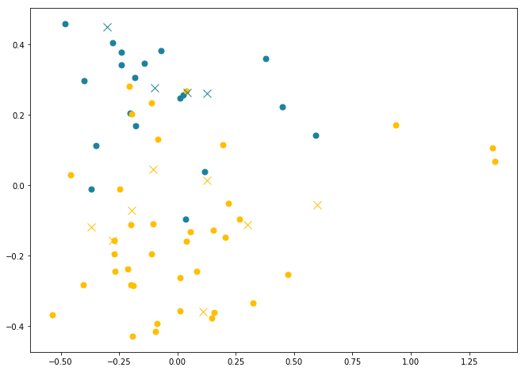
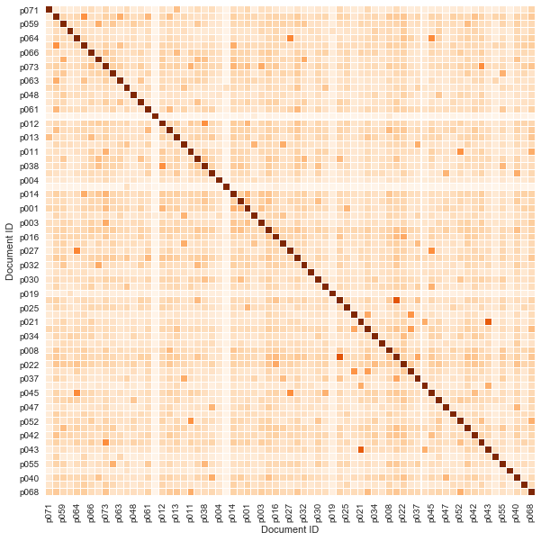
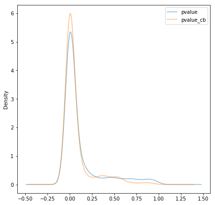
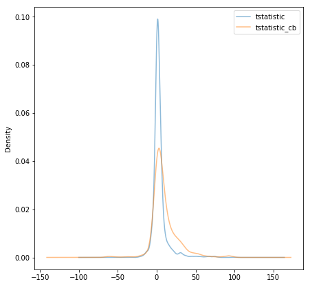

# Research Master Thesis Project

Maastricht University research thesis project aiming to quantify differences in the banking competition publications, between **central bank** and **university** economists.

Current dataset consists of 72 economic articles, of which:
 - **12** are affiliated to various **central banks** (authors are employed by CB)
 - **60** are written by **university or public organisations** researchers

### Methods used:
- `Natural Language Processing`
    - `k-means` clustering
    - `singular value decomposition`
    - `Latent Semantic Text Analysis`

- `Reported statistics analysis`
    - reviewing reported `p-values` and `t-statistics` to determine if Central Bank researcher show tendency to commit `Type II Error` more frequently

### Competition models covered:
- `Panzar-Rosse:` H-static

### Intermediate Results:

#### `K-means` on principal components
- `X` correspond to central bank paper
- Colors show class
- x-axis: first component, y-axis: second component

#### `Heatmap` using cosine similarity on tfidf

#### Statistics densities

